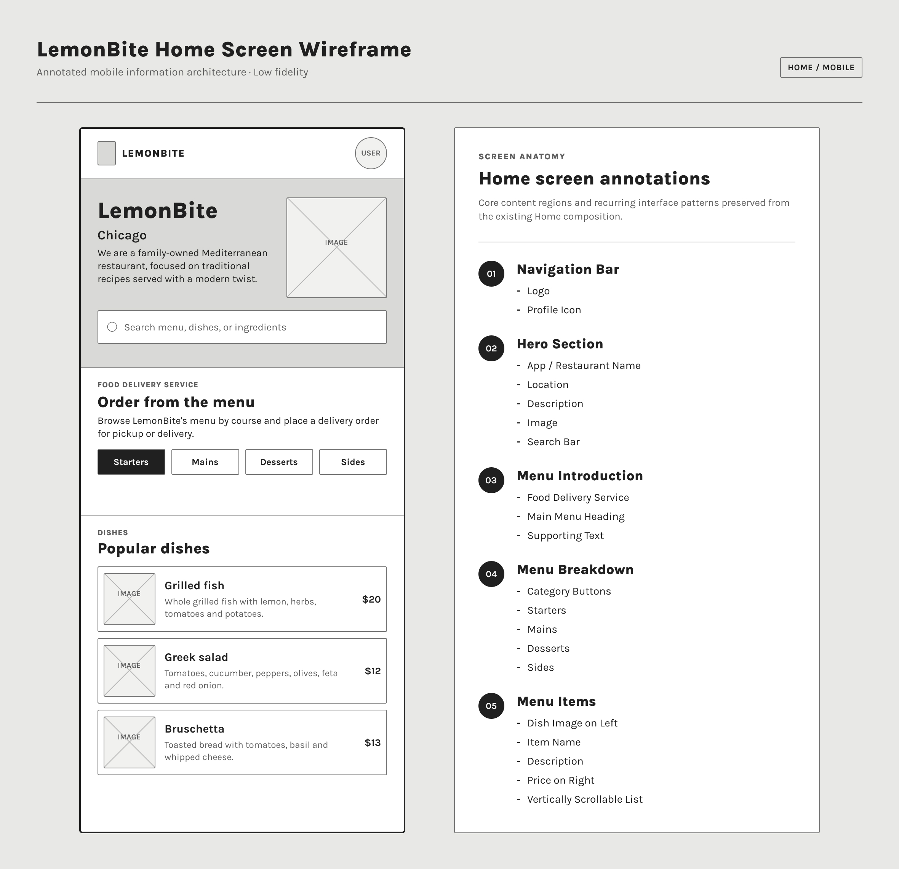
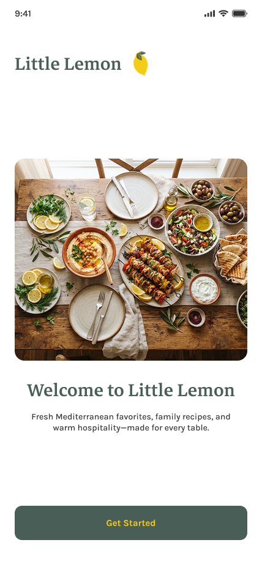
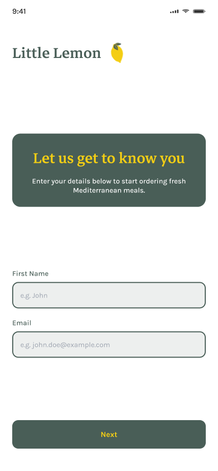
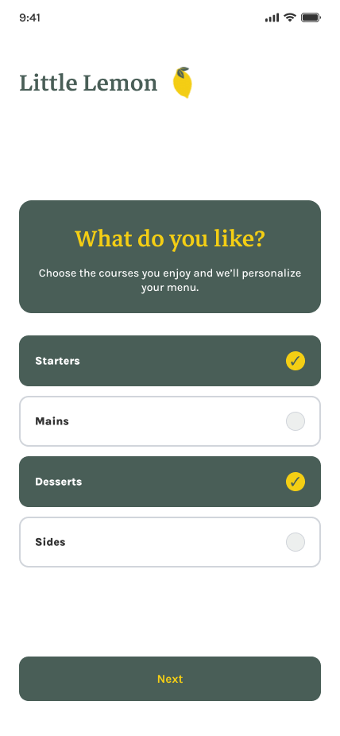
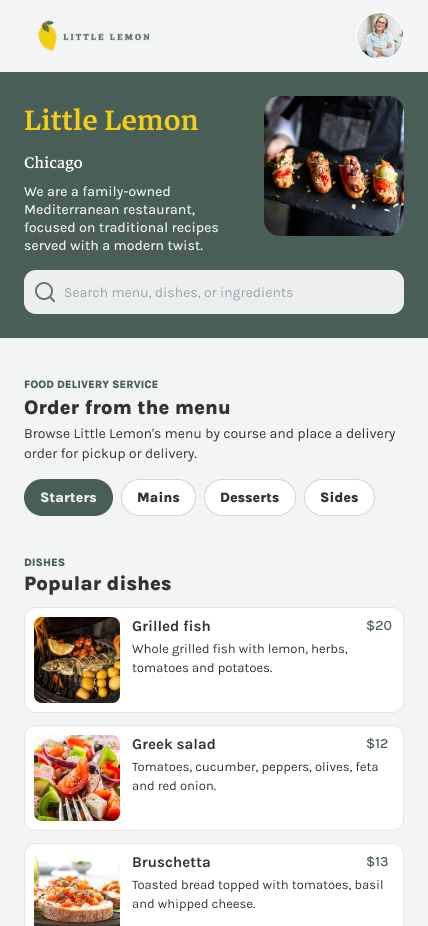
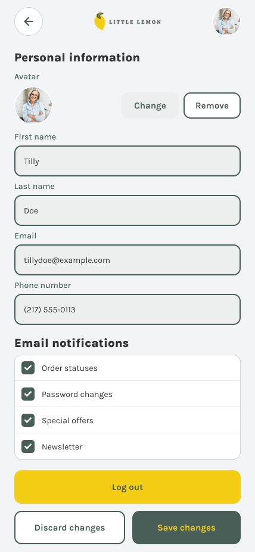

# LemonBite

LemonBite is a React Native mobile application developed as part of the React Native Capstone project.

The application implements onboarding, profile management, menu browsing, search and filtering, persistent user data, and mobile navigation.

## Wireframe

The Home screen was designed using a low-fidelity wireframe before implementation.



## Application Screens

### Welcome


### Sign Up


### Preferences


### Home


### Profile


## Features

- User onboarding
- Form validation
- Persistent profile information
- Profile editing
- Notification preferences
- Logout functionality
- Menu search
- Menu category filtering
- Food menu display
- Stack navigation
- Local data persistence

## Running the project

Clone the repository and install the dependencies:

```bash
npm install
